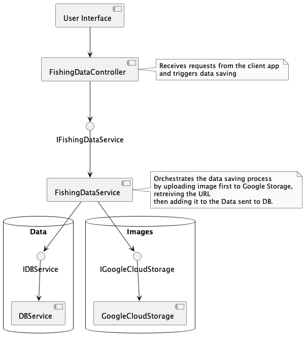

# FishOnTheGoApi Highly WIP
This is the codebase for the API which will be used by my application FishOnTheGo(name not final), more to be added soon.
This will be an app based around fishing location data and tracking your catch. 

Still very much in the design phase.

## Technologies

* Frontend: Flutter

* API: REST or GraphQL (undecided)

* Data DB: Likely Azure Cosmos DB or cheaper alternative

* Image storage: Google Cloud Storage.

